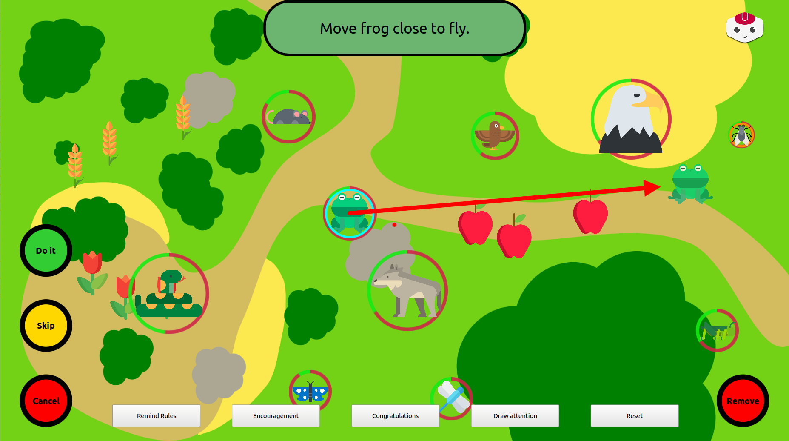

Robot Learning Tutoring -- Teacher GUI
======================================

*This work is heavily based on Séverin Lemaignan's [Free-play Sandbox](
https://github.com/freeplay-sandbox/qt-gui). It is designed to be used with the
[Robot Controller](https://github.com/emmanuel-senft/freeplay-sandbox-ros-sparc) and the [Food Chain Game](https://github.com/emmanuel-senft/freeplay-sandbox-qt).*

Pre-requisites
--------------

The Food Chain Game depends on 2 QtQuick extensions:

- [Box2D for QtQuick](https://github.com/qml-box2d/qml-box2d) for 2D physics
- my own [ROS plugin for QtQuick](https://github.com/emmanuel-senft/ros-qml-plugin)
(adapted from Séverin Lemaignan's)

Install both before running the game.

Installation
------------

Simply open the Qt project from QtCreator and run it from there.

Usage
-----

See [the Robot Controller repository](https://github.com/emmanuel-senft/freeplay-sandbox-ros-sparc) for detailed usage.

Interface
---------

This interface is intended to be used by the robot's teacher to select actions
and teach it a behaviour. The teacher can move animals on the screen and select
actions by pressing the five buttons on the lower part of the screen.
Additionally, the teacher can augment their demonstration by highlighting the
environmental features related to their selection (animals, plants or child gaze
in the top right corner).

This interface is also used to react to the robot's propositions. When one
arrives, a green bubble pops up at the top part of the screen, displaying the
proposed action, and would be joined by a red arrow if this action is a movement.
Facing this proposition, the teacher has 6 choices:
- Letting the action be executed after 2 seconds
- Enforcing the action by pressing the `Do it` button
- Preventing the action to be executed and informing the robot it should wait
by pressing the `Skip` button
- Cancel the action and indicating the robot it should not do this action in
that state in the future by using the `Cancel` button
- Removing the action from the memory if it's a real error by pressing the
`Remove` button
- Select other animals or actions, which does not evaluate the proposition.
